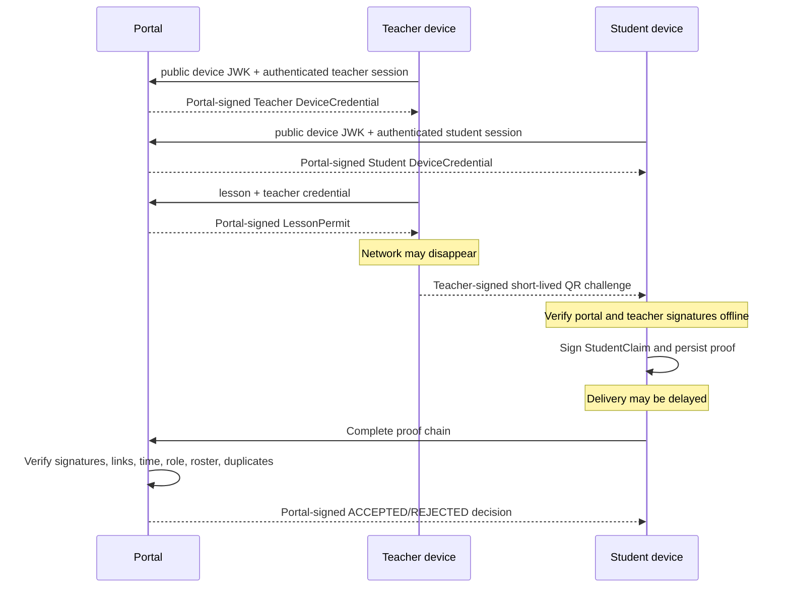

# AttendPro signed attendance protocol v1

Этот документ фиксирует wire-формат и границы доверия MVP. Он описывает не
шифрование содержимого QR, а цифровые подписи: QR видим любому человеку в
аудитории, однако незаметно изменить его или самостоятельно выпустить новый без
закрытого ключа преподавателя нельзя.

## 1. Примитивы

| Назначение | Выбор MVP |
| --- | --- |
| Подпись | ECDSA над кривой P-256 с SHA-256 (`ES256`) |
| Представление публичного ключа | EC JWK: `kty`, `crv`, `x`, `y` |
| Канонизация подписываемого JSON | RFC 8785 / JCS, UTF-8 |
| Представление подписи | raw IEEE P1363 `r || s`, 64 байта, Base64URL без padding |
| Хеш связи объектов | SHA-256(canonical JSON), Base64URL без padding |
| Идентификаторы и nonce | UUID v4 и 32 случайных байта Web Crypto |
| Время | RFC 3339 UTC (`...Z`) |

Приватные ключи устройств генерируются с `extractable=false`. Браузер может
попросить CryptoKey подписать данные, но штатный Web Crypto API не позволяет
экспортировать его как JWK/PEM. Это не заменяет аппаратный secure element: XSS,
полный доступ к профилю браузера или скомпрометированная ОС остаются угрозами.

## 2. Общая оболочка

Каждый подписанный объект передаётся как:

```json
{
  "payload": { "version": "attendpro.example.v1" },
  "signature": "base64url-raw-es256-signature",
  "key_id": "identifier-of-verification-key",
  "algorithm": "ES256"
}
```

Подписывается только `payload`, предварительно канонизированный RFC 8785. Поля
оболочки проверяются отдельно. Для связи StudentClaim со всей точной оболочкой
TeacherChallenge вычисляется `challenge_digest` — это не позволяет заменить
`key_id`, `algorithm` или `signature`, сохранив прежний payload.

## 3. Цепочка полномочий



Доверие передаётся по цепочке, а не возникает из факта наличия подписи:

1. Портал подтверждает связь `user ↔ role ↔ device public key`.
2. Портал разрешает этому ключу преподавателя работать с конкретной парой.
3. Преподаватель доказывает, что его устройство сформировало свежий QR.
4. Студент связывает свою идентичность и время сканирования с точным QR.
5. Портал подтверждает официальный результат после проверки внешних правил.

## 4. Подписанные payload

### DeviceCredential

Подписывает портал. Отдельный credential выдаётся каждому browser profile и
пользователю.

```json
{
  "version": "attendpro.device-credential.v1",
  "credential_id": "uuid",
  "device_id": "uuid",
  "user_id": "stable-sso-subject-uuid",
  "role": "teacher | student",
  "public_key_jwk": { "kty": "EC", "crv": "P-256", "x": "...", "y": "..." },
  "issued_at": "2026-08-06T12:00:00.000Z",
  "expires_at": "2026-09-05T12:00:00.000Z"
}
```

### LessonPermit

Подписывает портал и заранее передаёт преподавателю, поэтому QR можно создавать
офлайн.

```json
{
  "version": "attendpro.lesson-permit.v1",
  "permit_id": "uuid",
  "lesson_id": "uuid",
  "teacher_user_id": "uuid",
  "teacher_device_credential_id": "uuid",
  "allowed_kinds": ["ENTRY", "EXIT"],
  "issued_at": "...",
  "not_before": "...",
  "expires_at": "..."
}
```

### TeacherChallenge

Подписывает приватный ключ устройства преподавателя. Именно этот объект входит в
QR вместе с Teacher DeviceCredential и LessonPermit.

```json
{
  "version": "attendpro.teacher-challenge.v1",
  "challenge_id": "uuid",
  "lesson_id": "uuid",
  "permit_id": "uuid",
  "teacher_device_id": "uuid",
  "kind": "ENTRY | EXIT",
  "nonce": "32-random-bytes-as-base64url",
  "issued_at": "...",
  "expires_at": "..."
}
```

MVP задаёт TTL QR 90 секунд и допускает до 120 секунд clock skew. Portal также
ограничивает сам интервал challenge: злоумышленник не может подписать ключом
преподавателя QR на неделю, даже если permit действует дольше.

### StudentClaim

Подписывает приватный ключ устройства студента.

```json
{
  "version": "attendpro.student-claim.v1",
  "claim_id": "uuid",
  "challenge_id": "uuid",
  "challenge_digest": "sha256-of-complete-signed-challenge",
  "lesson_id": "uuid",
  "kind": "ENTRY | EXIT",
  "student_user_id": "uuid",
  "student_device_id": "uuid",
  "captured_at": "..."
}
```

Критически важно различать `captured_at` и `received_at`. Первый момент подписан
студентом и должен попасть внутрь окна challenge; второй ставит сервер при
синхронизации. Поэтому доказательство можно доставить значительно позже, не
выдавая время доставки за время присутствия.

### PortalDecision

Подписывает портал после полной проверки.

```json
{
  "version": "attendpro.portal-decision.v1",
  "decision_id": "uuid",
  "claim_id": "uuid",
  "status": "ACCEPTED | REJECTED",
  "reason_code": "PROOF_VALID",
  "evidence_hash": "sha256-of-complete-proof",
  "decided_at": "..."
}
```

`evidence_hash` делает решение ссылкой на конкретную версию всего доказательства,
включая secondary replica refs.

## 5. Серверная верификация

Portal принимает claim только если одновременно выполняются все условия:

1. Алгоритм, key id, версии объектов и подписи портала корректны.
2. Credential/permit существуют, byte-level содержимое соответствует сохранённым
   signed payload и signature, объекты не отозваны.
3. Роли, user/device/credential/lesson identifiers и public JWK согласованы между
   всеми объектами и строками БД.
4. TeacherChallenge проверяется публичным ключом из teacher credential, а
   StudentClaim — ключом из student credential текущей HttpOnly-сессии.
5. `challenge_digest` соответствует полной оболочке challenge.
6. `kind` равен `ENTRY` или `EXIT` и разрешён permit.
7. UUID корректны; challenge TTL ограничен; clock skew, credential, permit,
   challenge и lesson windows соблюдены на `captured_at`.
8. Преподаватель назначен на пару, студент состоит в roster.
9. Для сочетания `(student, lesson, kind)` ещё нет принятой записи.

Даже при отклонении портал возвращает подписанное решение с reason code. Принятая
запись и решение сохраняются в одной транзакции; повторная доставка того же
`claim_id` возвращает прежнее решение.

## 6. Что подписи доказывают и чего не доказывают

Подписи дают:

- целостность данных после подписания;
- авторство в смысле владения конкретным private key;
- проверяемую передачу полномочий от портала устройству;
- возможность офлайн-проверки и отложенной доставки;
- обнаружение подмены любого связанного поля.

Подписи сами по себе не доказывают:

- физическое нахождение человека в аудитории;
- что владелец не передал разблокированный телефон другому;
- что QR не сфотографировали и не переслали в пределах 90 секунд;
- истинность часов полностью скомпрометированного устройства;
- отсутствие XSS или вредоносной ОС.

Поэтому будущий anti-fraud слой может добавить proximity/BLE, device attestation,
короткий rotating challenge, risk scoring и ручную сверку преподавателем. Для
MVP блокчейн не нужен: он не решает физическое присутствие, SSO/roster или
компрометацию endpoint, а PostgreSQL + подписанные переносимые доказательства дают
необходимые свойства значительно проще.
