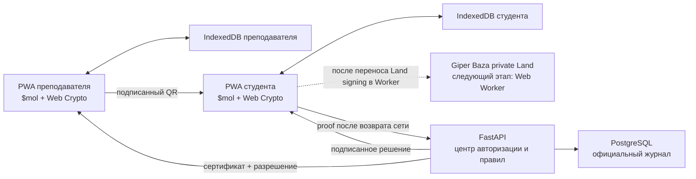

# AttendPro MVP: реализация и проверка

## 1. Что реализовано

MVP закрывает сквозной сценарий посещаемости и проверяет главный архитектурный
риск: можно ли создать содержательное, криптографически проверяемое доказательство
на двух браузерных устройствах без обязательной сети в момент сканирования.

Реализованы:

- `$mol` SPA/PWA без React и Vite;
- сервис-воркер через `$mol_offline`;
- IndexedDB через `$mol_db` для ключей, сертификатов, разрешений, очереди и решений;
- неэкспортируемые приватные P-256 ключи устройств через Web Crypto;
- цепочка подписей `DeviceCredential → LessonPermit → TeacherChallenge → StudentClaim → PortalDecision`;
- канонический JSON RFC 8785 и ECDSA P-256/SHA-256 (`ES256`);
- FastAPI, async SQLAlchemy, PostgreSQL 17 и Alembic;
- постоянный приватный ключ портала в отдельном Docker volume;
- HttpOnly cookie-сессия mock SSO;
- одна текущая и одна будущая тестовая пара;
- ровно три студента и один преподаватель;
- тестовая ручка и UI-кнопка, заново запускающие пару относительно реального текущего времени;
- `ENTRY` и `EXIT`, идемпотентная доставка и защита от повторной отметки;
- адаптер вторичной зашифрованной local-first реплики Giper Baza (автопубликация
  временно выключена до исполнения в Web Worker);
- подписанное решение портала, сохраняемое обратно на устройстве.

## 2. Архитектура MVP



Это гибридная, или частично децентрализованная, система:

- устройства автономно владеют ключами, проверяют QR и формируют доказательство;
- доказательство переносимо и проверяемо независимо от записи PostgreSQL;
- сеть в момент пары не является обязательной;
- формат доказательства и адаптер готовы для дополнительного локального
  signed/encrypted журнала Giper Baza, который должен исполняться в Worker;
- портал остаётся центром выдачи полномочий, проверки расписания/списка группы и
  формирования официального результата.

Именно такой баланс нужен MVP. Полностью децентрализованный консенсус не даёт
полезного ответа на университетские вопросы «кто зачислен», «кто ведёт пару» и
«какая отметка официальна», но существенно усложняет отзыв прав и исправление
ошибок.

## 3. Быстрый запуск

Из корня репозитория:

```bash
cp .env.example .env
docker compose up --build
```

Контейнер backend при старте выполняет `alembic upgrade head`, seed и Uvicorn.
Python-зависимости и сам пакет устанавливаются только через `uv`; версия UV в
Dockerfile зафиксирована как `0.10.2`.

Адреса:

- `$mol` PWA — <http://localhost:3000>;
- Swagger UI — <http://localhost:8000/docs>;
- backend healthcheck — <http://localhost:8000/health>.

Диагностика:

```bash
docker compose ps
docker compose logs -f backend
docker compose logs -f frontend
docker compose down
```

Удалить все локальные PostgreSQL-данные и постоянный ключ портала:

```bash
docker compose down -v
```

Это разрушительная операция: после неё ранее выданные сертификаты и решения не
будут проверяться новым ключом портала. Для обычного перезапуска `-v` не нужен.

## 4. Тестовые данные

| Роль | Email | Имя | Группа |
| --- | --- | --- | --- |
| Преподаватель | `teacher@attend.test` | Мельникова Антонина Владимировна | — |
| Студент | `student1@attend.test` | Иванов Иван | РСОДПО-П-МОиАИС-23.01 |
| Студент | `student2@attend.test` | Петрова Анна | РСОДПО-П-МОиАИС-23.01 |
| Студент | `student3@attend.test` | Смирнов Максим | РСОДПО-П-МОиАИС-23.01 |

Seed создаёт тестовую пару «Архитектура информационных систем», которая идёт в
момент первого запуска, и будущую пару «Криптография прикладных протоколов».
Повторный seed не создаёт дубликаты. Если текущая пара уже закончилась, seed
сдвигает её относительно текущего времени.

## 5. Ручной online-сценарий

Удобнее использовать два профиля браузера либо обычное и приватное окно: cookie
сессии разделятся, а JSON можно скопировать вручную.

1. Откройте приложение в первом окне и войдите как преподаватель.
2. Нажмите «Перезапустить тестовую пару на 90 минут». Backend сдвинет окно пары на
   `now - 5 минут … now + 85 минут`, отзовёт старое разрешение и выдаст новое.
3. Нажмите «Показывать QR “Вход”». Браузер преподавателя создаст nonce, подпишет
   challenge своим приватным ключом и покажет QR на 30 секунд. Интерфейс
   автоматически выпускает следующий challenge каждые 25 секунд.
4. Во втором окне войдите как `student1@attend.test`.
5. Отсканируйте QR камерой или вставьте JSON из поля преподавателя.
6. Телефон проверит подписи портала и преподавателя, связи объектов и сроки,
   подпишет StudentClaim и сначала положит proof в IndexedDB.
7. При доступной сети очередь сразу отправится на портал. Портал повторит все
   проверки, сверит студента со списком группы и вернёт подписанное `ACCEPTED`.
8. Повторите для двух других студентов. Вход одного и того же студента на ту же
   пару второй раз будет отклонён как `DUPLICATE_ATTENDANCE`.
9. Аналогично можно создать QR `EXIT`; это отдельный допустимый тип отметки.

## 6. Ручной offline-сценарий

«Offline» здесь означает отсутствие соединения во время показа и сканирования,
но требует предварительной подготовки доверия.

1. При сети один раз войдите преподавателем. PWA сохранит в IndexedDB его
   неэкспортируемый private `CryptoKey`, подписанный сертификат, текущую пару и
   `LessonPermit`.
2. При сети один раз войдите студентом. PWA сохранит его ключ/сертификат и
   открытый ключ портала.
3. Дайте PWA загрузиться и установите режим Offline в DevTools → Network.
4. Преподаватель создаёт QR локально: backend для этого не вызывается.
5. Студент сканирует QR, локально проверяет подписи, создаёт свою подпись и видит
   сообщение, что запись находится в IndexedDB.
6. Верните сеть и нажмите «Синхронизировать сохранённые отметки». Можно также
   просто создать отметку при online: автоматическая синхронизация использует тот
   же путь.

Если разрешение пары или сертификат истёк, офлайн-устройство не должно «угадывать»
новые полномочия: потребуется сеть. Это осознанная граница безопасности.

## 7. Проверка API без UI

Mock SSO использует HttpOnly cookie. Пример запуска пары:

```bash
COOKIE_JAR=$(mktemp /tmp/attendpro-cookie-XXXXXX)
curl -c "$COOKIE_JAR" \
  -H 'Content-Type: application/json' \
  -d '{"email":"teacher@attend.test"}' \
  http://localhost:3000/api/v1/auth/mock/login

curl -b "$COOKIE_JAR" \
  -H 'Content-Type: application/json' \
  -d '{"duration_minutes":90}' \
  http://localhost:3000/api/v1/test/lessons/start-now
```

Основные endpoints:

| Method/path | Назначение |
| --- | --- |
| `GET /api/v1/system/trust` | Открытый ключ портала |
| `GET /api/v1/auth/mock/accounts` | Четыре mock SSO subject |
| `POST /api/v1/auth/mock/login` | Имитация SSO callback и cookie-сессия |
| `POST /api/v1/devices/enroll` | Сертификат публичного ключа устройства |
| `GET /api/v1/schedule/current` | Текущая разрешённая пользователю пара |
| `POST /api/v1/test/lessons/start-now` | Перезапуск тестовой пары преподавателем |
| `POST /api/v1/lessons/{id}/permit` | Подписанное разрешение пары |
| `POST /api/v1/claims/sync` | Пакетная синхронизация proof, максимум 100 |
| `GET /api/v1/attendance/me` | Принятые отметки студента |
| `GET /api/v1/lessons/{id}/attendance` | Журнал пары преподавателя |

## 8. Giper Baza и граница браузерного MVP

Giper Baza подключена непосредственно как MAM-пакет, а не имитирована REST
заглушкой. Адаптер умеет создать private Land с запрещённым anonymous-доступом и
сформировать ссылку вида `giper://<land>/<claim>`.

При проверке на мобильном viewport выяснилось, что текущий pipeline подписания и
сохранения Land выполняет длительную синхронную работу на главном потоке. Поэтому
автоматическая публикация из обработчика студенческой отметки выключена: сначала
IndexedDB надёжно сохраняет self-contained proof, затем портал синхронизирует его,
а интерфейс остаётся отзывчивым. Возвращать Giper в этот путь безопасно только
через отдельный Web Worker; простая `requestIdleCallback`-отсрочка переносит, но
не устраняет блокировку.

Но Giper намеренно не является единственной официальной БД:

- secondary replica не участвует в критическом пути создания отметки;
- портал проверяет подписи без доверия к Giper;
- PostgreSQL обеспечивает уникальные ограничения, roster queries, аудит и
  административную отчётность;
- в MVP нет worker-host для Giper, общего relay и обмена правами между устройствами.

Следующий технический этап — Giper worker-host; затем университетский relay,
политика ACL и репликация private Land на второе доверенное устройство.
Wire-протокол посещаемости для этого менять не нужно.

## 9. Автоматические проверки

Backend:

```bash
cd backend
uv sync --locked --group dev
uv run pytest -q
```

Тесты проверяют RFC 8785/ES256, постоянство ключа портала, mock SSO/cookie,
перезапуск пары, выдачу разрешения, полный offline proof, подпись решения,
идемпотентность, Giper reference, подмену claim, malformed UUID и границы ролей.

Frontend:

```bash
cd frontend
npm ci
npm test
```

`npm test` запускает MAM-сборку, строгий TypeScript audit и `$mol_test`, включая
детерминированную канонизацию и подпись неэкспортируемым Web Crypto ключом.
Предупреждения о deprecated `draw?...` сейчас приходят из upstream `$mol`, не из
AttendPro. Уязвимая старая build-time версия `debug`, приходившая через MAM →
`autoinstall`, закреплена npm override на исправленной `2.6.9`; `npm audit`
завершается с `0 vulnerabilities`. Production nginx-образ всё равно не содержит
`node_modules`.

## 10. Локальная разработка

Backend:

```bash
cd backend
cp .env.example .env
uv sync --locked --group dev
uv run alembic upgrade head
uv run python -m app.seed
uv run uvicorn app.main:app --reload
```

Frontend в другом терминале:

```bash
cd frontend
npm ci
npm run dev
```

MAM workspace автоматически создаётся в игнорируемой директории `frontend/.mam`,
а исходники AttendPro подключаются в неё symlink. Production bundle копируется в
игнорируемый `frontend/dist`.

## 11. Что сознательно осталось за границей MVP

- реальный OIDC/SAML SSO и lifecycle университетских subject;
- интеграция с боевым расписанием и событиями изменения roster;
- аппаратная аттестация устройства, passkey/WebAuthn и безопасное восстановление
  потерянного ключа;
- защита от передачи физически показанного QR по видеосвязи или фотографии;
- Giper Web Worker, relay, backup/ACL между несколькими устройствами и
  наблюдаемость репликации;
- UI отзыва устройства и разрешения, хотя поля и серверная проверка отзыва уже есть;
- production rate limits, WAF, KMS/HSM, key rotation и многоузловой deployment;
- формальная privacy/DPIA-политика и сроки удаления доказательств.

Ключевое свойство MVP: эти дополнения усиливают эксплуатацию и anti-fraud, но не
требуют выбросить реализованный формат подписанного доказательства.
